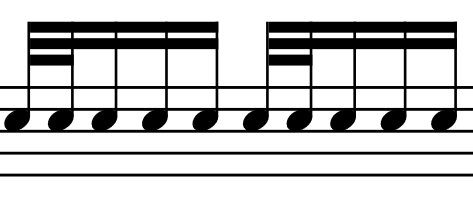

```@meta
EditURL = "<unknown>/../JuliaMusic_documentation.jl/docs/src/blog/garibaldi_dragadiddle.jl"
```

# Garibaldi's Foot+Hand doubles

Have a look at the following simple rudiment involving a double stroke



Here the sticking could be single strokes, as in **Rr L R L** on repeat, or
it can also follow the standard "dragadiddle", **Rr L R R Ll R L L**.

David Garibaldi uses and teaches an interesting concept that replaces the
double stroke by a foot+hand combination. This works irrespectively of the
above stickings, and the double stroke bomes a foot stroke and a tom stroke.
It looks like this:


I wished to study this concept in detail, and in the following I set up
some code that produces exercises for me to work on. It also
uses a relatively new feature of [`random_notes_sequence`](@ref) which
can weight different patterns with different probabilities, so that they appear
more or less frequently.

## Textbook exercises
Before we devle into the actual random sequences of this new kind of pattern
I create some straight forward exercises that have this pattern in different
locations in the bar. For the sticking, I assume the single strokes, so that
I also have exercise variants with two foot-hand strokes next to each other.

First, let's define the basic variables necessary for the code.
Be sure that you have read the section on [Drum Notation](@ref) before reading this,
to be able to understand how I actually write drum notation in MuseScore.

```@example garibaldi_dragadiddle
using MusicVisualizations # re-exports MusicManipulations

bass = "Acoustic Bass Drum"
snare = "Acoustic Snare"
tom = "Low-Mid Tom"
tpq = 960 # duration of a quarter note in ticks
sixt = 960 ÷ 4 # duration of a sixteenth note in ticks
```

For creating the patterns, one should notice that only two different
"motifs" are necessary, one with the foot+hand double stroke and one
that is only a single stroke. We can then use clever programming to create
all possible combinations.

```@example garibaldi_dragadiddle
motif0 = [DrumNote(snare, 0, sixt)]

motif1 = [DrumNote(bass, 0, sixt÷2), DrumNote(tom, sixt÷2, sixt÷2)]
```

The first step is to create some basic exercises that put this double foot+hand
stroke into the different possible locations within a quarter note.
These variations are 4 in total. In the following we will store them
all into a single `exercises` container, while each exercise will be
`bars` bars long.

```@example garibaldi_dragadiddle
bars = 2
exercises = Note[]

for j in 1:4 # create the 4 possible variations

    # Create 1 quarter note of the variations
    exercise = [translate(motif0, k*sixt) for k in 0:3]
    exercise[j] = translate(motif1, (j-1)*sixt)
    exercise = vcat(exercise...)
    ex0 = copy(exercise)

    # Repeat to fill one bar with variation. 1 quarter note = 4sixt
    for k in 1:3; append!(exercise, translate(ex0, 4k*sixt)); end
    ex0 = copy(exercise)

    # Repeat as many bars as needed. 1 bar = 16 sixt
    for b in 0:bars-1; append!(exercise, translate(ex0, 16b*sixt)); end

    # Add it to the exercises (but translated for the bars)
    append!(exercises, translate(exercise, (j-1)*bars*16*sixt))
end
```

We then create a second exrcise type where one quarter note will contain
two doubles of foot+hand. There are two ways for this (assuming that we do *not*
want the doubles to be next to each other).

```@example garibaldi_dragadiddle
for j in 5:6
    exercise = [translate(motif0, k*sixt) for k in 0:7] # repeat it 8 times
    for m in (j, j+2)
        exercise[m] = translate(motif1, (m-1)*sixt)
    end
    exercise = vcat(exercise...)
    ex0 = copy(exercise)

    # Repeat to fill one bar with variation. 1 quarter note = 4sixt
    # Notice this is a 2 quarter not pattern
    for k in 1:1; append!(exercise, translate(ex0, 8k*sixt)); end
    ex0 = copy(exercise)

    # Repeat as many bars as needed. 1 bar = 16 sixt
    for b in 0:bars-1; append!(exercise, translate(ex0, 16b*sixt)); end

    # Add it to the exercises (but translated for the bars)
    append!(exercises, translate(exercise, (j-1)*bars*16*sixt))
end
```

Finally, one last exercise with the foot+hand double repeated
every three sixteen-th notes.

```@example garibaldi_dragadiddle
motif001 = [
DrumNote(bass, 0, sixt÷2),
DrumNote(tom, sixt÷2, sixt÷2),
DrumNote(snare, sixt, sixt),
DrumNote(snare,2sixt, sixt),
]

j = 7
exercise = [translate(motif001, 3k*sixt) for k in 0:7] # repeat it 10 times
exercise = vcat(exercise...)
append!(exercises, translate(exercise, (j-1)*bars*16*sixt))
exercises
```

Nowe we use [`musescore`](@ref) to make a sheet of the exercises
```julia
musescore("garibaldi_draga_exercise.png", Notes(exercises, tpq))
```


## Randomized exercises

Now I want to have random sequences with a foot+hand double stroke springled
into random locations. This is easy to do with[`random_notes_sequence`](@ref).
However, I want to be sure that a double stroke will never be followed by
another double stroke. To ensure this, I define

```@example garibaldi_dragadiddle
motif2 = [
DrumNote(bass, 0, sixt÷2),
DrumNote(tom, sixt÷2, sixt÷2),
DrumNote(snare, sixt, sixt),
]
```

Recall that `motif0` is a normal single stroke. Therefore, I have to randomly
mix `motif0` and `motif2`

```@example garibaldi_dragadiddle
motifs = Notes.([motif0, motif2], tpq)
```

To make the exercise easy, I want the double stroke to not appear too often.
This is easily done by adjusting the  `weight` keyword:

```@example garibaldi_dragadiddle
rseq, = random_notes_sequence(motifs, 16sixt*16; weights = [4, 1])
rseq
```

And again, export it into a score:

```julia
musescore("garibaldi_draga_sequence_easy.png", Notes(exercises, tpq))
```


Finally, I'll make one more exercise where the foot+hand double appears a bit
more frequently.

```@example garibaldi_dragadiddle
rseq, = random_notes_sequence(motifs, 16sixt*16; weights = [2, 1])
```

```julia
musescore("garibaldi_draga_sequence_hard.png", Notes(exercises, tpq))
```


